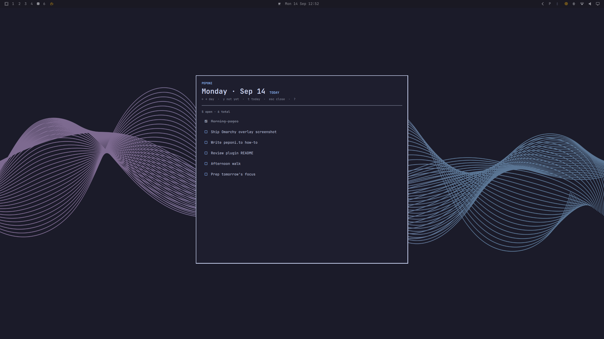

# Peponi One Day (Omarchy)

Keyboard-first **one-day** focus overlay for [Omarchy](https://omarchy.org/).

Use it **locally on this machine** (no account) or sign in to **any Peponi instance** — a hosted week on [peponi.to](https://peponi.to), or a copy you run from [source](https://github.com/Nikolaos-Gkionis/todo_app). Default login copies your tasks onto this machine so they survive when the hosted week ends.

Browse today with `h`/`l` (or arrows), tick with `Space` or a click, reorder with `K`/`J` or the row arrows, add with `n`, remove with `Delete`, open **Not Yet** with `y`, send a Not Yet task to today with `a`, jump to today with `t`. A small local `peponi` CLI stores tasks on disk, and can copy a snapshot from an instance when you sign in.



| | |
|---|---|
| **Plugin id** | `peponi.one-day` |
| **Kinds** | `service` · `overlay` · `bar-widget` |

## Install

Omarchy plugins run as unsandboxed code inside the long-lived `omarchy-shell` process. Review a plugin before you enable it.

```bash
omarchy plugin add https://github.com/Nikolaos-Gkionis/peponi-omarchy.git --enable
```

That clones into `~/.config/omarchy/plugins/peponi.one-day` and enables it. With `--enable`, Omarchy also asks where to put the **bar toggle** (left / center / right).

Then finish setup (CLI + choose local or instance sign-in + optional keybindings):

```bash
~/.config/omarchy/plugins/peponi.one-day/scripts/setup.sh
```

Setup asks how you want to use it:

1. **Use locally on this Omarchy machine** — no account. Tasks live in `~/.local/share/peponi/store.json`.
2. **Sign in to an instance** — peponi.to for a free hosted week, or `--url https://your.host` for a self-hosted clone. We copy existing tasks onto this machine. Hosted accounts are removed after the week, so pull or self-host before then.

You can also pick later in the overlay: `l` for local, `a` to sign in (the terminal asks for the instance URL).

**Full walkthrough:** [docs/USAGE.md](docs/USAGE.md) · app source: [github.com/Nikolaos-Gkionis/todo_app](https://github.com/Nikolaos-Gkionis/todo_app) · site: [peponi.to/how-to#omarchy](https://peponi.to/how-to#omarchy)

Open it:

```bash
omarchy-shell shell toggle peponi.one-day '{}'
```

### Local / development install

From this checkout (copy into Omarchy plugins, no git URL needed):

```bash
./scripts/install.sh
./scripts/setup.sh
```

Skip the prompt:

```bash
PEPONI_SETUP_MODE=local ./scripts/setup.sh
# or
PEPONI_SETUP_MODE=cloud ./scripts/setup.sh
```

Point the CLI at any instance (self-hosted, or Rails on localhost):

```bash
export PEPONI_BASE_URL=http://127.0.0.1:3000
PEPONI_SETUP_MODE=cloud ./scripts/setup.sh
```

## Requirements

- Omarchy Linux (Quickshell + `omarchy` CLI)
- `python3` (and `curl` only if you sign in to an instance)
- Optional: a Peponi account on peponi.to (hosted week) or on your own clone
- Instance `/api/v1` desktop endpoints (only for the sign-in / sync path)

## After install

```bash
peponi auth local          # this machine only, no account
peponi auth login          # peponi.to or last-saved instance
peponi auth login --url https://peponi.home
peponi auth host           # show remembered instance URL
peponi auth status --json
peponi day $(date +%F) --json
peponi add $(date +%F) "Buy milk"
peponi tick ID
peponi move ID up
peponi pref roll-over on
peponi rm ID
peponi not-yet --json
peponi not-yet add "Call mum"
peponi not-yet today ID
```

- **Local mode:** `~/.local/share/peponi/store.json` (mode `0600`). Flag: `~/.config/peponi/config.json`.
- **Cloud mode:** `~/.config/peponi/credentials.json` (mode `0600`).

Switch anytime: `peponi auth local` or `peponi auth login --url …` (copies a snapshot, then stays local). `peponi pull` refreshes the copy. `peponi auth login --cloud --url …` keeps a live connection to that instance. `peponi auth logout` leaves both and keeps local task files.

## Keybindings

**In-overlay:** `h`/`l` or `←`/`→` day · `j`/`k` list · `Space` tick · `K`/`J` move · `n` add · `r` roll unfinished to today · `Delete` remove · `y` Not Yet · `t` today · `Esc` close · `?` help · `l` use locally · `a` sign in (the last two only when not set up yet, and `a` is sign-in only while the drawer is **closed**)

Mouse: click the checkbox to tick, `↑`/`↓` on a row to reorder, or the roll-over line under the heading.

### Not Yet (the `y` drawer)

**Not Yet** is an undated inbox: tasks you are not doing today. They live in the same local file as your days (`~/.local/share/peponi/store.json`). Open the drawer, then use the same muscle memory as the day list.

| Key | What it does |
|-----|----------------|
| `y` | Open or close the Not Yet drawer |
| `n` | Add a Not Yet task (type a title, Enter) |
| `↑` / `↓` or `j` / `k` | Highlight a task in the drawer |
| `K` / `J` | Move the highlighted Not Yet task up / down |
| `a` | Move the **highlighted** Not Yet task onto **today** |
| `Delete` | Remove the highlighted Not Yet task |
| `Esc` | Close the drawer (then the overlay) |

While the drawer is open, those keys apply to Not Yet, not the day. `a` means “sign in” only when you are **not set up yet** and the drawer is **closed**.

**Optional global** (setup script or `scripts/install-binding.sh`):

| Chord | Action |
|-------|--------|
| `SUPER + ALT + O` | Toggle overlay |
| `SUPER + ALT + LEFT/RIGHT` | Prev / next day |
| `SUPER + ALT + Y` | Toggle Not Yet drawer |
| `SUPER + ALT + SPACE` | Tick highlighted task |
| `SUPER + ALT + K` / `J` | Move highlighted task up / down |

## Uninstall

```bash
~/.config/omarchy/plugins/peponi.one-day/scripts/uninstall.sh
# or:
omarchy plugin remove peponi.one-day --yes
```

## Layout

```
manifest.json          # Omarchy plugin contract (repo root)
preview.png            # Plugin directory listing screenshot
qml/                   # Overlay, Service, BarWidget, …
bin/peponi             # CLI (local store or any instance)
scripts/install.sh     # Dev copy install
scripts/setup.sh       # CLI + local-or-sign-in (+ optional binds)
scripts/install-binding.sh
scripts/uninstall.sh
docs/
```

## Publishing this repo

When you create the GitHub remote, the install line above works unchanged. Keep `preview.png` at the repository root so [plugins.omarchy.org](https://plugins.omarchy.org/) can show it on listing cards. The Rails app (any instance, including peponi.to) lives at [Nikolaos-Gkionis/todo_app](https://github.com/Nikolaos-Gkionis/todo_app). Local mode does not need that API.

## License

[MIT](LICENSE) — Copyright (c) 2026 Peponi.to / Nikolaos Gkionis.

**Dependencies:** Omarchy (Quickshell + `omarchy` CLI), `python3`. `curl` only if you sign in to a Peponi instance. No extra packages. Local mode needs no account and no network.
